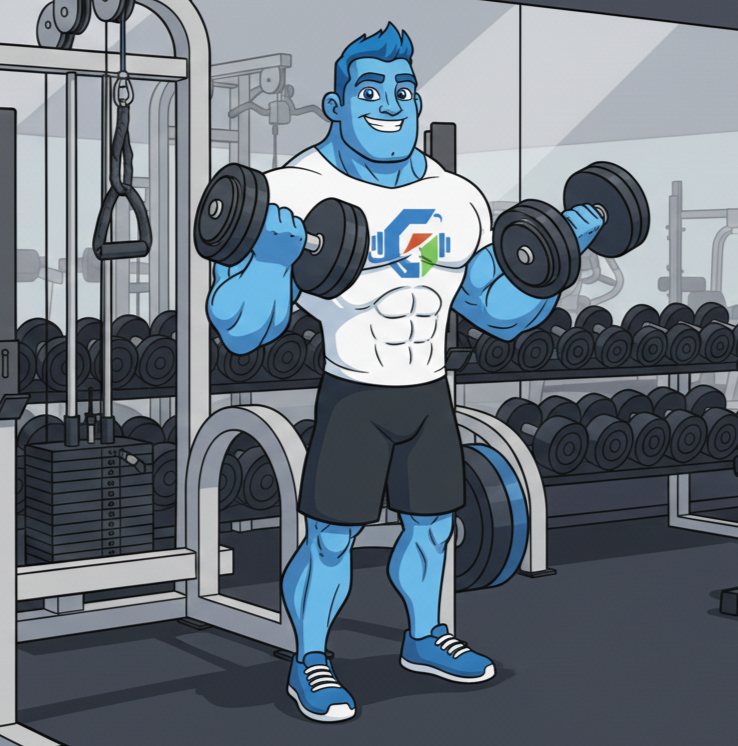
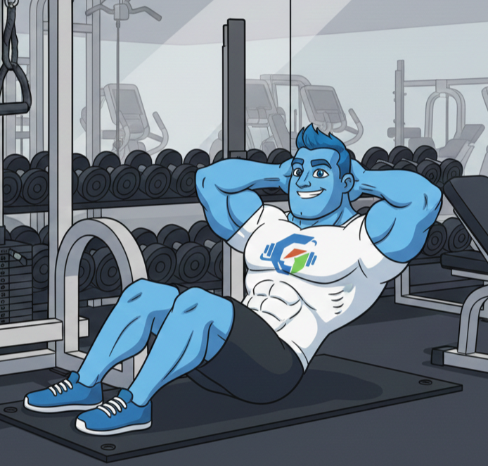

<div align="center">


# 💪 GStrong

### *Your Personal Fitness Companion — Built to Push You Further*

[](https://reactnative.dev/)
[](https://expo.dev/)
[](https://www.typescriptlang.org/)
[](https://www.apple.com/ios/)
[](https://www.android.com/)

<br/>


> *"Every rep counts. Every day matters. Let's get Strong."*

</div>

---

## 🏋️ What is GStrong?

**GStrong** is a feature-rich fitness tracking mobile app built with **React Native & Expo**. Designed around a dark, high-performance aesthetic, GStrong helps you track workouts, hit milestones, and stay accountable — week after week.

Whether you're a beginner just starting out or an elite athlete pushing your limits, GStrong meets you where you are.

---

## ✨ Features

| Feature | Description |
|---|---|
| 🗓️ **Weekly Bingo** | Complete workout tasks in a 5×5 bingo grid. Finish lines, earn bonus points, and share your progress. |
| 🏆 **Achievements** | Unlock badges and milestones as you hit goals — tracked and displayed on your profile. |
| 🧍 **Profile & Stats** | Track your height, weight, experience level, primary goal, and personal bio. |
| ⚙️ **Settings** | Full control over notifications, email preferences, sound effects, haptic feedback, and more. |
| 🔒 **Auth Flow** | Multi-step onboarding with goal selection, experience level, and workout preferences. |
| 💪 **Exercise Library** | Browse exercises organized by muscle group with animated mascot visuals. |
| 📊 **Progress Tracking** | Visual stats, progress bars, and point totals across your fitness journey. |

---

## 📸 Meet George Strong

<div align="center">


&nbsp;&nbsp;&nbsp;


*George Strong — your animated fitness guide inside the app*

</div>

---

## 🚀 Getting Started

### Prerequisites

- [Node.js](https://nodejs.org/) v18+
- [Expo CLI](https://docs.expo.dev/get-started/installation/)
- iOS Simulator / Android Emulator or physical device with [Expo Go](https://expo.dev/client)

### Installation

```bash
# Clone the repository
git clone https://github.com/yourusername/GStrong.git

# Navigate into the project
cd GStrong

# Install dependencies
npm install

# Start the development server
npx expo start
```

Then press `i` for iOS simulator, `a` for Android emulator, or scan the QR code with Expo Go on your phone.

---

## 🛠️ Tech Stack

- **Framework:** React Native + Expo Router (file-based routing)
- **Language:** TypeScript
- **Navigation:** Expo Router v3
- **Animations:** React Native Animated API
- **Icons:** Expo Vector Icons (Ionicons)
- **Styling:** React Native StyleSheet

---

## 🎨 Design System

GStrong uses a consistent dark-blue design language throughout:

| Token | Value | Usage |
|---|---|---|
| Background | `#060a14` | Screen backgrounds |
| Surface | `#0c1120` | Cards & panels |
| Border | `#1a2540` | Card borders |
| Primary | `#2563eb` | Buttons, toggles, accents |
| Text Primary | `#ffffff` | Headings |
| Text Muted | `#6b7280` | Descriptions, labels |
| Danger | `#ef4444` | Destructive actions |


---

<div align="center">

Built with ❤️ and 💪 by the **GStrong** team


*Stay consistent. Stay Strong.*

</div>